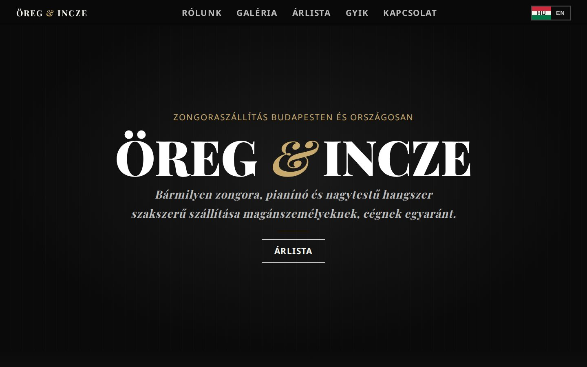
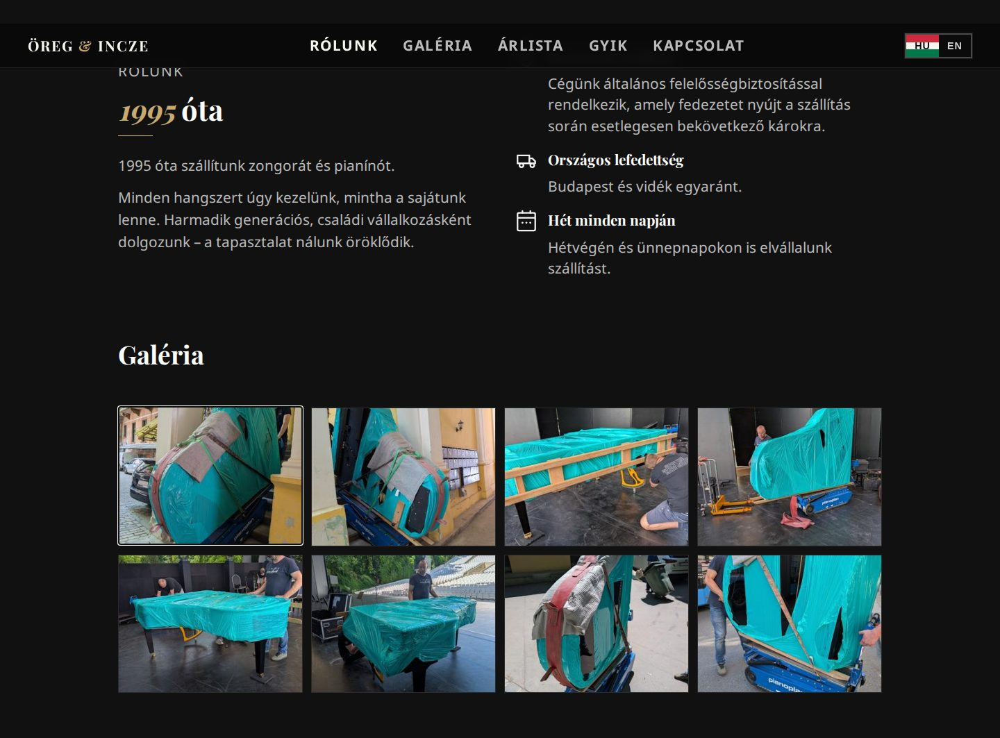
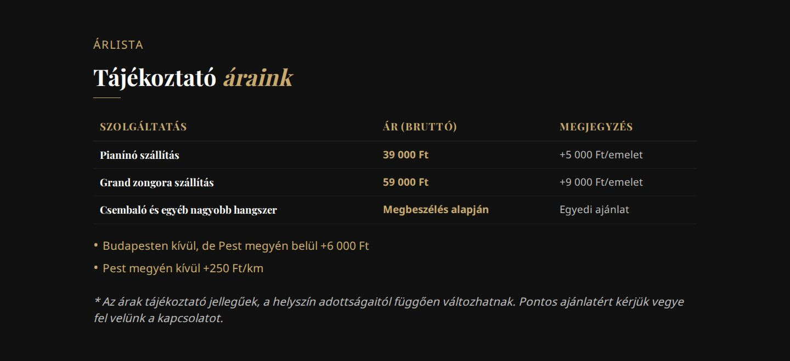
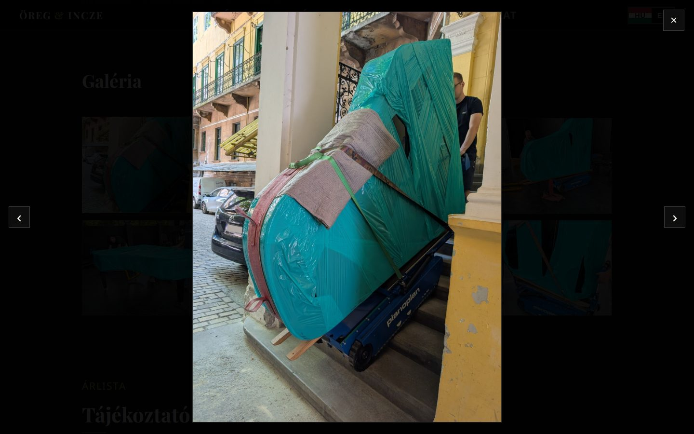
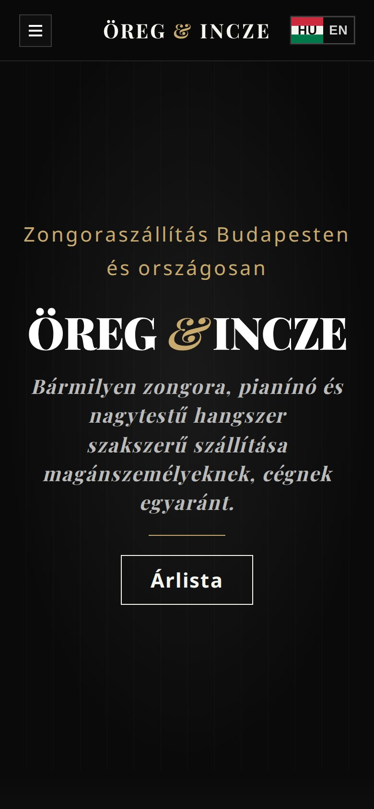
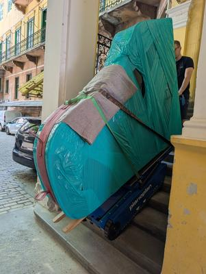
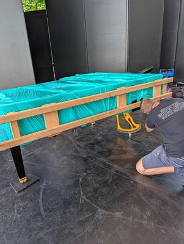
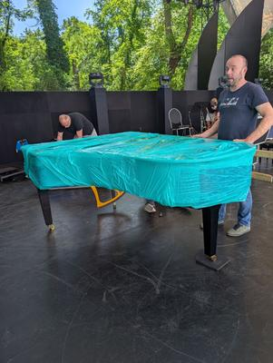
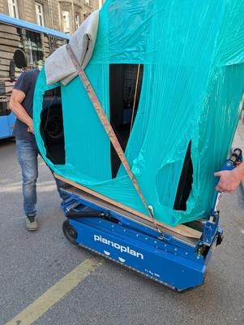

# Öreg & Incze – Zongoraszállítás

Az **Öreg & Incze** zongoraszállító családi vállalkozás (1995 óta) weboldala: **[hangszerszallitas.hu](https://hangszerszallitas.hu/)**.
Statikus, build lépés nélküli HTML/CSS/JS oldal kétnyelvű (HU/EN) felülettel, galériával, árlistával és keresőkre optimalizált aloldalakkal.



## Oldalak

| URL | Tartalom |
|---|---|
| `/` | Kezdőlap: rólunk, galéria, árlista, partner, kapcsolat |
| `/zongoraszallitas-budapest/` | Zongoraszállítás Budapesten, kerületenként |
| `/pianino-szallitas/` | Pianínó szállítás |
| `/zongoraszallitas-arak/` | Részletes árak, emeleti felár, kilométerdíj |
| `/zongoraszallitas-orszagosan/` | Országos szállítás (Budapest–vidék, vidék–vidék) |
| `/zongoraszallitas-pest-megye/` | Szállítás Pest megyében, településlistával |
| `/hangszerszallitas/` | Hangszerszállítás (csembaló, egyéb nagytestű hangszerek) |
| `/zongoraszallitas-tippek/` | Tippek a zongora költöztetése előtt |
| `/gyik/` | Gyakori kérdések |

## Képernyőképek

| Rólunk + galéria | Árlista |
|---|---|
|  |  |

| Galéria nagyítva | Mobil nézet |
|---|---|
|  |  |

A galéria képei (`pictures/`) saját szállításokról készültek:

<p>
  
  
  
  
</p>

## Funkciók

- **Kétnyelvű felület (HU / EN)**: a szövegek `data-i18n` attribútumokkal vannak megjelölve, a fordítások az `index.html` végén lévő szkriptben találhatók.
- **Galéria lightbox-szal**: a bélyegképek lusta betöltéssel (`data-lazy`) töltődnek be, és csak kattintásra nyílik meg a teljes méretű kép. A nagyított kép zoomolható és mozgatható, a képek között lapozni lehet.
- **Reszponzív**: mobilon hamburger menü; görgetéskor a menü kiemeli az aktuális szekciót.
- **SEO**:
  - oldalanként egyedi `title` és `meta description`,
  - JSON-LD strukturált adatok: `MovingCompany`, `BreadcrumbList`, a GYIK oldalon `FAQPage`,
  - `sitemap.xml` és `robots.txt` (a Googlebot és az OAI-SearchBot is engedélyezve).
- **Partner**: a Szonáta Zongoraterem ([szonatapiano.hu](https://szonatapiano.hu)) logója (`sonata.webp` / `sonata.png`).

## Felépítés

```
oreg-es-incze/
├── index.html                    # kezdőlap (stílusok: assets/style.css, szkript: inline)
├── assets/style.css              # közös stíluslap
├── zongoraszallitas-budapest/    # aloldalak (mindegyik egy index.html)
├── pianino-szallitas/
├── zongoraszallitas-arak/
├── zongoraszallitas-orszagosan/
├── zongoraszallitas-pest-megye/
├── hangszerszallitas/
├── zongoraszallitas-tippek/
├── gyik/
├── pictures/                     # galéria: teljes méretű képek + thumb_* bélyegképek
├── logo.svg, sonata.webp, sonata.png
├── sitemap.xml, robots.txt
└── docs/                         # README képek
```

## Helyi futtatás

Nincs build lépés, elég egy statikus szerver:

```bash
python3 -m http.server 8000
# → http://localhost:8000
```

## Deploy

Az oldal statikus fájlokból áll, bármilyen statikus tárhelyen futtatható. Jelenleg Netlify-on fut: a repó gyökere a publikált mappa, build parancs nem kell.

Új képek hozzáadása a galériához:

1. Tedd a teljes méretű képet a `pictures/` mappába, és készíts hozzá egy kicsinyített `thumb_<fájlnév>` változatot.
2. Vegyél fel egy új `gallery-thumb` gombot az `index.html` galéria részébe (`data-src` = nagy kép, `data-lazy` = bélyegkép).

Ha új aloldalt veszel fel, add hozzá a `sitemap.xml`-hez és a lábléc linkjeihez is.
